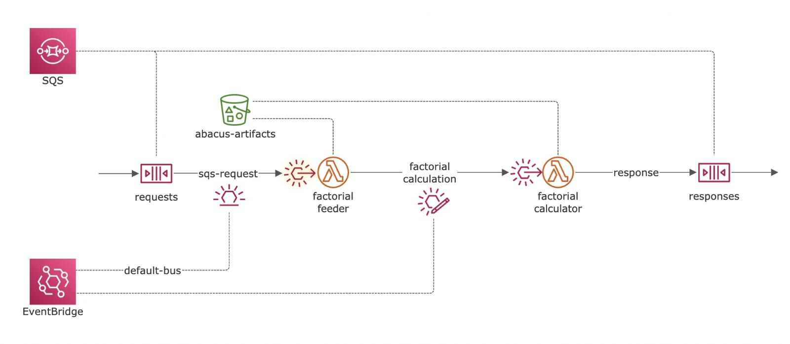

# AWS-Abacus

## Descripción
AWS-Abacus es  un proyecto que simula un entorno AWS utilizando LocalStack en una máquina virtual de Docker. 

## Arquitectura

AWS-Abacus integra varios servicios de AWS para procesar y calcular eventos. A continuación, se describe cada componente de la arquitectura:


## SQS (Simple Queue Service)
- `requests`: Cola para las solicitudes entrantes.
- `responses`: Cola para las respuestas procesadas.

## EventBridge
- **Bus de eventos personalizado (`abacus-bus`)**: Utilizado para la integración y enrutamiento de eventos.
- **`sqs-request-rule`**: Dirige eventos de la cola SQS de solicitudes a `factorial-feeder`.
- **`factorial-calculation-rule`**: Activa por eventos en `abacus-bus` y dirige a `factorial-calculator`.

## S3 (Simple Storage Service)
- `s3://datalake`: Almacenamiento de eventos.
- `s3://abacus-artifacts`: Contiene los artefactos del proyecto, incluyendo los archivos JAR de las funciones Lambda.

## IAM (Identity and Access Management)
- **Política IAM (`service-execution-policy`)**: Define los permisos para las funciones Lambda.
- **Rol IAM (`service-role`)**: Permite a las funciones Lambda asumir este rol.

## Lambda
- `factorial-feeder`: Procesa eventos de la cola SQS de solicitudes y los envía al bus de EventBridge.
- `factorial-calculator`: Realiza cálculos basados en eventos recibidos del bus de EventBridge.


Esta arquitectura facilita un sistema escalable y eficiente para el procesamiento de eventos dentro de un entorno AWS.


## Requisitos
- Docker
- Docker Compose
- AWS CLI

## Instalación y Configuración
1. **Clonar el repositorio:**
    ```bash
    git clone https://github.com/josejuanhernandez/aws-abacus
    ```

2. **Iniciar LocalStack:**[credentials](..%2F..%2F.aws%2Fcredentials)
   Sustituye en el docker-compose.yml [YOUR_API_KEY] por tu API_KEY de localstack.
   Utiliza Docker Compose para arrancar la máquina virtual de LocalStack:
    ```bash
    docker-compose up -d
    ```

3. **Configurar AWS CLI:**
   Configura tu AWS CLI para interactuar con LocalStack:
    ```bash
    aws configure --profile localstack
    ```

## Uso
### Inicializar cloud
Ejecuta el script `setup.sh` para crear todos los recursos necesarios en LocalStack:
```bash
./setup.sh
```

### Test
Envía un evento al bridge y consulta la cola responses
```bash
aws events put-events --entries '[{"Source": "test", "DetailType": "factorial-calculation", "Detail": "{\"number\": 2 }", "EventBusName": "abacus-bus"}]'
aws sqs receive-message --queue-url '"http://sqs.us-east-1.localstack:4566/000000000000/responses'
```

